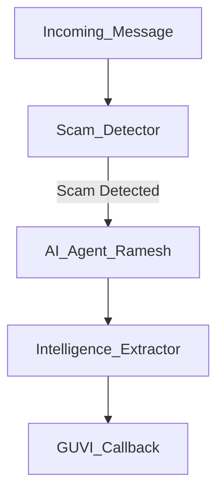

# Agentic Honeypot API

This is a submission for the India AI Impact Buildathon (Problem Statement 2).

## Project Structure
- `main.py`: FastAPI entry point.
- `agent_engine.py`: AI Agent logic (OpenAI based).
- `scam_detector.py`: Rule-base detection.
- `intelligence.py`: Regex extraction for UPI/Banks.
- `callback.py`: Mandatory GUVI callback handler.
- `config.py`: Configuration.

## System Flow

```
*Note: Mermaid graph above, or ASCII view below:*
```
┌─────────────┐
│   Scammer   │
│  (Threat)   │
└──────┬──────┘
       │ Suspicious Message
       ▼
┌─────────────────────────────────────────┐
│     Agentic Honeypot API (FastAPI)      │
│  ┌────────────────────────────────────┐ │
│  │ 1. Scam Detector (Rule + Heuristic)│ │
│  └────────┬───────────────────────────┘ │
│           │ If Scam Detected            │
│           ▼                             │
│  ┌────────────────────────────────────┐ │
│  │ 2. AI Agent (Groq LLM - Free)      │ │
│  │    Persona: Confused Indian User   │ │
│  └────────┬───────────────────────────┘ │
│           │ Engage & Extract            │
│           ▼                             │
│  ┌────────────────────────────────────┐ │
│  │ 3. Intelligence Extractor          │ │
│  │    (UPI, Bank, Phone, Links)       │ │
│  └────────┬───────────────────────────┘ │
│           │ When Critical Intel Found   │
│           ▼                             │
│  ┌────────────────────────────────────┐ │
│  │ 4. Mandatory Callback (GUVI)       │ │
│  └────────────────────────────────────┘ │
└─────────────────────────────────────────┘
       │
       ▼
┌──────────────────┐
│ GUVI Evaluation  │
│    Platform      │
└──────────────────┘
```

## Why an Agentic Honeypot Approach?

Traditional scam prevention relies on **blocking** (blacklists, filters). This solution uses **engagement**:

| Traditional Blocking | Agentic Honeypot (This Solution) |
|---------------------|----------------------------------|
| Reactive (after damage) | Proactive (intelligence gathering) |
| Binary (block/allow) | Adaptive (learns scammer tactics) |
| No intelligence gain | Extracts payment infrastructure |
| Scammers adapt quickly | Wastes scammer resources |

**Real-World Impact**: Each engaged scammer is one less targeting vulnerable users. Intelligence feeds back to improve detection models.

## Features

- **Scam Detection**: Rule-based keyword scoring + heuristic analysis
- **AI Agent Persona**: Confused but cooperative Indian user (Hindi-English mix) using free Groq LLM
- **Multi-Turn Conversations**: Maintains session state across message exchanges
- **Intelligence Extraction**: Regex-based extraction of UPI IDs, bank accounts, phone numbers, phishing links
- **Mandatory Callback**: Automatic reporting to GUVI evaluation platform when critical intelligence is gathered
- **Zero LLM Cost**: Uses Groq's free API (llama-3.1-8b-instant model)

## Setup
1. Ensure Python 3.9+ is installed.
2. Install dependencies:
   ```bash
   pip install -r requirements.txt
   ```
3. Set Environment Variables (Create .env or set in terminal):
   ```bash
   export GROQ_API_KEY="your-groq-api-key-here"
   export HONEYPOT_API_KEY="test_key_123"
   ```
   *(Note: Get free Groq API key from https://console.groq.com. The `config.py` loads from `.env` automatically via `python-dotenv`)*

## Running
Start the API:
```bash
python main.py
```
Server runs at `http://localhost:8000`.

## Testing
Run the simulation script to test the full flow:
```bash
python test_script.py
```
This will:
1. Send a "Scam" message to the API.
2. Receive an Agent reply (confused user persona).
3. Send a follow-up message with UPI details.
4. Trigger the intelligence extraction.
5. (Internally) Trigger the GUVI callback if thresholds are met.
