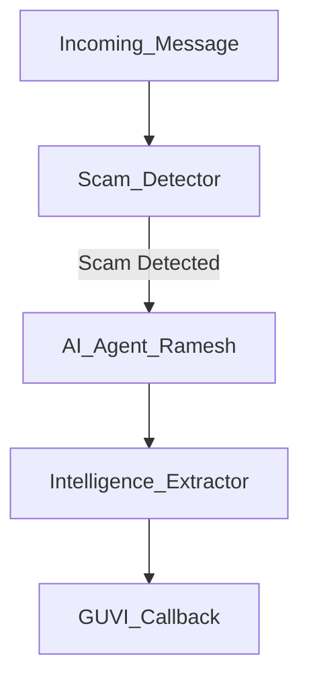

# Agentic Honeypot API

This is a submission for the India AI Impact Buildathon (Problem Statement 2).

## Project Structure
- `main.py`: FastAPI entry point.
- `agent_engine.py`: AI Agent logic (OpenAI based).
- `scam_detector.py`: Rule-base detection.
- `intelligence.py`: Regex extraction for UPI/Banks.
- `callback.py`: Mandatory GUVI callback handler.
- `config.py`: Configuration.

## System Flow

*Note: Mermaid graph above, or ASCII view below:*
```
Incoming Message
   ↓
Scam Detector
   ↓
AI Agent (Ramesh)
   ↓
Intelligence Extractor
   ↓
GUVI Callback
```

## Setup
1. Ensure Python 3.9+ is installed.
2. Install dependencies:
   ```bash
   pip install -r requirements.txt
   ```
3. Set Environment Variables (Create .env or set in terminal):
   ```bash
   export OPENAI_API_KEY="your-key-here"
   export HONEYPOT_API_KEY="test_key_123"
   ```
   *(Note: The `config.py` loads from `.env` automatically via `python-dotenv`)*

## Running
Start the API:
```bash
python main.py
```
Server runs at `http://localhost:8000`.

## Testing
Run the simulation script to test the full flow:
```bash
python test_script.py
```
This will:
1. Send a "Scam" message to the API.
2. Receive an Agent reply (confused user persona).
3. Send a follow-up message with UPI details.
4. Trigger the intelligence extraction.
5. (Internally) Trigger the GUVI callback if thresholds are met.
